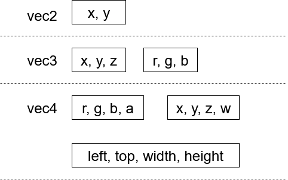

# linmath.hpp -- A small library for linear math as required for computer graphics

linmath.hpp provides the most used types required for programming computer graphics:

- `vec2`, `vec3`, `vec4` -- 2-4 element vector of floats (4th component used for homogenous computations)
- `ivec2`, `ivec3`, `ivec4` -- 2-4 element vector of signed ints
- `uvec2`, `uvec3`, `uvec4` -- 2-4 element vector of unsigned ints
- `mat4f` -- 4 by 4 elements matrix, computations are done in column major order
- `quat` -- quaternion (SOON)

The types are deliberately named like the types in GLSL. In fact they are meant to
be used for the client side computations and passing to same typed GLSL uniforms.

This is a C++ rewrite of [the original C library](https://github.com/datenwolf/linmath.h) by Wolfgang 'datenwolf' Draxinger.

